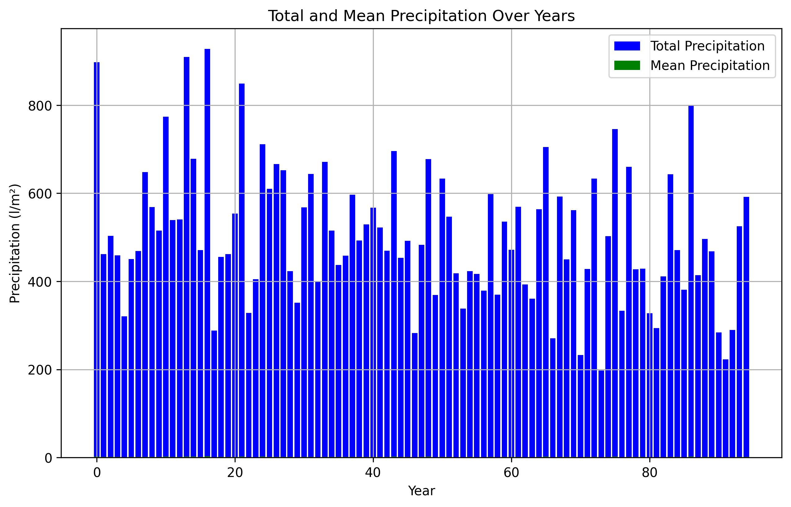
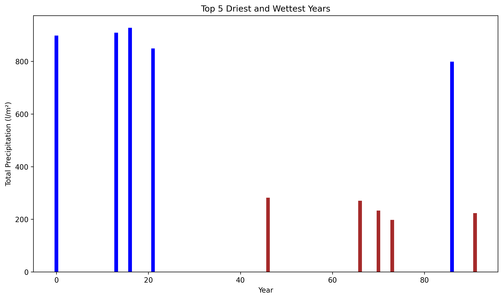
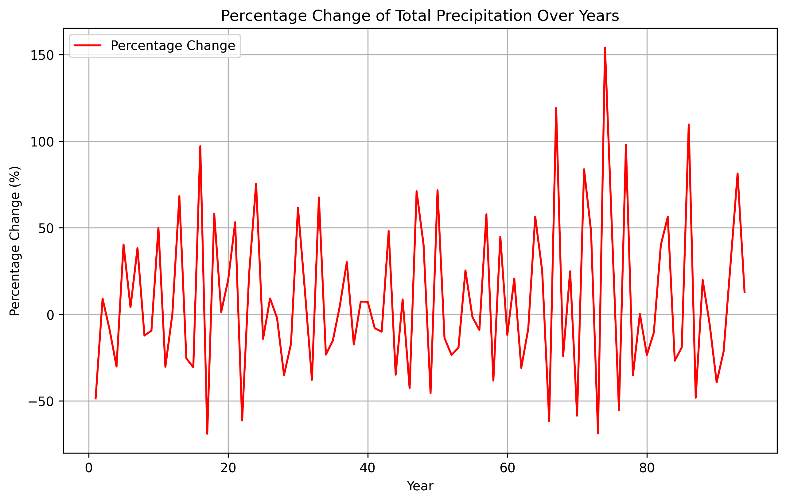

# TA06 - Climate Data Analysis Project 🌍


**Leveraging AI and Meteorological Data for Green Transformation Solutions**

[](https://python.org)
[](LICENSE)


---

*In the face of urgent challenges such as climate change, loss of biodiversity,  resource constraints, emerging micropollutants or waste of water. For instance,  cities need to improve or reinvent urban services.
It is compulsory to design and deploy innovative solutions and unique technologies for managing water, waste and energy.
The objective of this task, is to use the power of data and the most advanced AI technologies trained with “our expertise”, to tailor solutions in the green transformation, be it decarbonization, decontamination, resource saving and regeneration, or any other solution.*
It is for this reason that we set ourselves the challenge of processing the data that the AEMET “Agencia Estatal de Meteorología” publishes on the web OpenData AEMET.

---

## Table of Contents

1. [Obtención de datos](#1-obtención-de-datos)  
2. [Organización y procesamiento de datos](#2-organizacion-y-procesamiento-de-datos)  
3. [Análisis de datos y visualización](#3-analisis-de-datos-y-visualizacion)  
   3.1 [Análisis de datos](#3.1-analisis-de-datos)  
   3.2 [Visualización de datos](#3.2-visualizacion-de-datos)
4. [Publicación de datos](#4-publicacion-de-datos)  
5. [Reflexión](#5-reflexion)  
6. [Referencias](#6-referencias)  

---

## 1. Obtención de datos

Para realizar esta tarea es necesario obtener los datos de una fuente fiable de meteorología. En este caso, se ha optado por la **AEMET**, la Agencia Estatal de Meteorología de España.  

La AEMET pone a disposición de los usuarios una **API** para la obtención de datos meteorológicos. Se ha elegido la API de datos abiertos de AEMET, la cual está disponible en la siguiente dirección:  

➡️ [https://opendata.aemet.es/centrodedescargas/altaUsuario](https://opendata.aemet.es/centrodedescargas/altaUsuario)  

---

### Pasos:  

1. **Obtener la API Key**  
   Una vez obtenida la clave de acceso (API Key), podemos acceder a los datos deseados desde:  
   ➡️ [https://www.aemet.es/es/serviciosclimaticos/cambio_climat/datos_diarios](https://www.aemet.es/es/serviciosclimaticos/cambio_climat/datos_diarios)  

2. **Datos seleccionados:**  
   - **Método:** Regresión rejilla  
   - **Modelo:** MIROC5  
   - **Escenario:** RCP 6.0  
   - **Variable:** Precipitación  
   - **Periodo:** 2006–2100  

3. **Descarga del archivo con los datos:**  
   Los datos se pueden descargar desde los siguientes enlaces:  
   - [Enlace 1](https://www.aemet.es/documentos_d/serviciosclimaticos/cambio_climat/datos_diarios/reg_e/ar5/sdsm_rej/MIROC5/RCP60/precip.MIROC5.RCP60.2006-2100.SDSM_REJ.tar.gz)  
   - [Enlace 2](https://www.aemet.es/documentos_d/serviciosclimaticos/cambio_climat/datos_diarios/reg_e/ar5/sdsm_rej/MIROC5/RCP60/precip.MIROC5.RCP60.2006-2100.SDSM_REJ.tar.gz)  

# 2. Organizacion y procesamiento de datos

Una vez descargado el fichero, lo descomprimimos y obtenemos los ficheros con los datos de precipitación.

### Ejemplo de datos: 
````csv
precip	MIROC5	RCP60	REGRESION	decimas	1
P1	35.307	-2.948	182	geo	2006	2100	-1
P1 2006 1 0 0 0 24 21 20 0 0 0 0 0 20 35 37 18 0 0 0 13 14 0 0 0 0 0 0 0 0 14 0 0 
P1 2006 2 0 0 0 13 0 0 0 0 2 0 0 0 0 0 31 0 0 0 0 0 23 25 21 26 0 0 0 0 -999 -999 -999 
P1 2006 3 0 0 11 0 0 16 20 24 0 0 39 38 23 0 0 19 17 0 12 0 0 0 0 0 16 0 0 7 0 15 20 
P1 2006 4 9 0 0 0 0 7 0 0 0 15 6 0 0 0 0 0 0 0 14 0 0 0 0 0 0 15 23 0 0 19 -999 
P1 2006 5 0 14 15 16 0 0 11 0 0 0 0 0 0 0 0 0 0 0 10 6 0 0 0 0 0 0 0 0 0 0 0 
P1 2006 6 0 0 0 0 0 0 0 0 0 0 0 0 0 0 0 0 0 0 0 8 0 0 0 0 0 7 0 0 0 0 -999 
P1 2006 7 0 0 0 0 0 0 0 0 0 0 4 0 0 0 0 0 0 0 0 0 0 0 0 0 0 0 1 0 0 0 0 
P1 2006 8 0 0 0 0 0 0 0 0 0 0 0 0 0 4 0 4 0 0 4 0 0 0 0 0 0 0 0 0 0 0 0 
P1 2006 9 0 5 0 0 0 0 0 0 0 0 5 0 0 4 0 0 0 0 0 0 0 0 0 9 0 0 6 0 0 0 -999 
````

### Detalles de los datos  

Los datos descargados tienen la siguiente estructura:  

1. **Primera fila**:  
   Contiene información sobre el tipo de datos en el archivo:  
   - Variable: Precipitación  
   - Modelo: MIROC5  
   - Escenario: RCP60  
   - Método: Regresión  
   - Unidades: Décimas  

2. **Segunda fila**:  
   Incluye información de referencia:  
   - Longitud y latitud de la localización  
   - Año de inicio y fin de los datos  
   - Valor de la décima  

3. **Estructura de las columnas**:  
   - **Primera columna**: ID de la estación (e.g., `P1`).  
   - **Segunda columna**: Año.  
   - **Tercera columna**: Mes.  
   - **Columnas siguientes**: Valores de precipitación para cada día del mes (hasta 31 días).  

---

### Validación de la estructura de los ficheros  

Teóricamente, todos los archivos deben seguir esta misma estructura. Sin embargo, es necesario validar que:  

1. **Cabecera uniforme**:  
   - Todos los archivos deben tener la misma primera línea de cabecera.  

2. **Número de líneas y columnas**:  
   - Cada archivo debe contener **1140 líneas** (12 meses × 95 años) + 2 líneas de cabecera.  
   - Cada línea debe tener **34 columnas** (ID de estación, año, mes y 31 días).  

3. **Formato de los datos**:  
   - Todas las columnas (excepto la primera y las dos filas de cabecera) deben contener valores de tipo **INT**.  

4. **Datos completos**:  
   - No deben existir datos nulos ni valores inconsistentes.  

---

### Solución implementada  

Para garantizar la calidad de los datos y que cumplan con las condiciones anteriores, hemos desarrollado un script en Python que realiza las siguientes validaciones:  
- Verifica que la primera línea de todos los archivos sea idéntica.  
- Comprueba que cada archivo contenga exactamente 1140 líneas y 34 columnas.  
- Valida que los valores en las columnas (excepto las filas de cabecera) sean de tipo **INT**.  

De esta manera, aseguramos la integridad y uniformidad de los datos antes de proceder con el análisis.  


**task_02/Data_Validation.py**

### Breakdown del script

Este script se compone de tres funciones principales, cada una con un propósito específico relacionado con la validación de los datos descargados. A continuación, se detalla el propósito y funcionamiento de cada función.

---

### 1. **Comprobar si un string existe en un fichero**

```python
def string_exists_in_file(filepath, target_string):
    try:
        with open(filepath, 'r', encoding='utf-8') as file:
            return any(target_string in line for line in file)
    except FileNotFoundError:
        logging.error(f"The file '{filepath}' was not found.")
    except PermissionError:
        logging.error(f"Permission denied to read the file '{filepath}'.")
    except Exception as e:
        logging.error(f"An unexpected error occurred: {e}")
    return False
```

#### **Propósito**
Revisa si un string específico (`target_string`) está presente en un fichero (`filepath`).

---

#### **Uso**
Se utiliza para comprobar si la primera línea de los ficheros es correcta.

---

#### **Detalles**
- **Errores manejados:**
  - Si el fichero no existe: Se registra un error en el log.
  - Si no se tienen permisos para leer el fichero: Se registra un error en el log.
  - Si ocurre un error inesperado: Se registra el error correspondiente en el log.
---

### 2. **Comprobar las dimensiones de un fichero**

```python
def check_file_dimensions(df, filename):
    """
    Checks if the DataFrame has 1140 rows and 33 columns.
    If dimensions differ, logs an error with the actual dimensions.
    """
    rows, cols = df.shape
    if rows != 1140 or cols != 34:
        logging.error(
            f"Dimension mismatch in file '{filename}': Found {rows} rows and {cols} columns, "
            "expected 1140 rows and 33 columns."
        )
```
#### **Propósito**
Valida que las dimensiones del fichero sean las esperadas: **1140 filas** y **34 columnas**.

---

#### **Detalles**

- **Entrada**:
  - `df`: DataFrame que representa el contenido del fichero.
  - `filename`: Nombre del fichero (para registro en el log).

- **Salida**:
  - No devuelve nada. Registra un error en caso de que las dimensiones no sean correctas.

---

#### **Validación esperada**
- **Filas**: 1140 (corresponden a 12 meses × 95 años).  
- **Columnas**: 34 (incluyen ID de estación, año, mes y 31 días).

---

#### **Uso**
Garantiza que cada fichero procesado cumple con la estructura requerida antes de realizar análisis adicionales.

---

### 3. **Validar valores enteros con logging**

```python
def validate_integers_with_logging(df, filename):
    for col in df.columns[1:]:
        for idx, value in enumerate(df[col]):
            try:
                int(value)
            except (ValueError, TypeError):
                logging.warning(
                    f"Invalid value '{value}' at row {idx}, column '{col}' in file '{filename}'"
                )
```
#### **Propósito**
Verifica que los valores en el fichero (excluyendo las cabeceras) sean de tipo `INT`.

---

#### **Detalles**

- **Entrada**:
  - `df`: DataFrame que contiene los datos del fichero.
  - `filename`: Nombre del fichero (para registro en el log).

- **Salida**:
  - No devuelve nada. Genera un warning si encuentra valores no válidos.

---

#### **Validación esperada**
- Todas las columnas (excepto la primera) deben contener valores enteros.

- **Errores manejados**:
  - `ValueError`: Valores no convertibles a entero.
  - `TypeError`: Tipos incompatibles con enteros.

---

#### **Uso**
Garantiza la consistencia del tipo de datos en los ficheros, ayudando a identificar valores inválidos o inconsistencias antes de realizar análisis adicionales.

#### **Una vez hemos validado los datos, podemos procesarlos y generar estadisticas.**

---

# 3. Análisis de Datos y Visualización

## 3.1 Análisis de Datos

Para realizar el análisis, se ha diseñado un script en Python que permite procesar los datos y generar estadísticas relevantes.

---

### Estadísticas Generadas

Al ejecutar el script, se calculan las siguientes métricas:

1. **Total de ficheros procesados**:  
   Número total de ficheros que se han analizado.

2. **Total de valores procesados**:  
   Cantidad de datos individuales procesados (por fila y columna).

3. **Total de valores nulos procesados**:  
   Cantidad de valores que están vacíos o son inválidos.

4. **Porcentaje de valores nulos**:  
   Relación porcentual de valores nulos respecto al total.

---

### Fichero de Resultados

El script genera un único fichero que consolida la **media de todas las estaciones**, lo que permite obtener valores promedio a nivel nacional. La estructura del fichero es la siguiente:

```csv
YEAR    Mean                TotalPrecip         PctChange
2006    2.5051546391752577  897.80206185567
2007    1.288659793814433   461.5556701030927   -48.59048673277695
```

### Breakdown del script:

```python

for file_name in tqdm(lista_archivos, desc='Procesando archivos', unit='it'):
    file_path = os.path.join(Folder_path, file_name)

    try:
        # Leer el archivo CSV omitiendo las primeras dos filas
        df = pd.read_csv(file_path, skiprows=2, sep=r'\s+', engine='python', header=None)

        # Crear los nombres de los headers
        df.columns = column_name

        df.replace(-999, pd.NA, inplace=True)

        # Mostrar total de valores y valores nulos
        total_valores_procesados += df.size
        total_valores_nulos_procesados += df.isnull().sum().sum()

        # Cambiar el formato del DF a long format
        df_melted = df.melt(id_vars=['ID', 'YEAR', 'MONTH'], var_name='DAY', value_name='VALUE')
        # Ordenar los valores por año y mes
        df_melted = df_melted.sort_values(by=['YEAR', 'MONTH'])

        # Contar el total de dias sin valores (null) (por año)
        total_null_days = df_melted.groupby('YEAR')['VALUE'].apply(lambda x: x.isna().sum())

        # Contar el total de dias (por año)
        total_count_days = df_melted.groupby('YEAR')['VALUE'].count()

        # Calcular el total de dias validos (con datos para hacer la divison luego) (por año)
        total_valid_days = total_count_days - total_null_days
        # calcular la precipitacion total por año i pasarla a metros por litro cuadrado (mm -> m^3)
        df_total_precip = df_melted.groupby('YEAR')['VALUE'].sum() / 10

        # Combrovar que si un año es bisiesto se le añade un dia
        for year in total_valid_days.index:
            if is_leap_year(year):
                total_valid_days.loc[year] += 1

        # Calcular la media de precipitacion por año
        df_with_mean = df_total_precip / total_valid_days

        # Juntar los dos dataframes
        combined_df = pd.concat([df_with_mean.rename('Mean'), df_total_precip.rename('TotalPrecip')], axis=1)

        # Agregar los resultados al DataFrame agregado
        if aggregated_results.empty:
            aggregated_results = combined_df
        else:
            aggregated_results = aggregated_results.add(combined_df, fill_value=None)

        file_count += 1

    except Exception as e:
        logging.error(f'Error processing file {file_name}: {e}')
```
#### **Descripción**
Este bloque de código procesa múltiples archivos de datos meteorológicos, calcula la precipitación total y la media anual para cada archivo, y luego agrega los resultados en un DataFrame global. Durante el proceso, se realiza una serie de validaciones como la conversión de valores nulos, el ajuste para años bisiestos, y la conversión de los datos a un formato más manejable. También mantiene un registro de los valores procesados, los valores nulos y maneja errores que puedan ocurrir durante el procesamiento de los archivos. Finalmente, genera estadísticas de precipitación a nivel nacional a partir de todos los archivos procesados.

---

```python
aggregated_results['Mean'] = aggregated_results['Mean'].astype(int)

# Calcular la media de los valores agregados
mean_results = aggregated_results / file_count

# Ensure 'TotalPrecip' is in mean_results
mean_results['TotalPrecip'] = aggregated_results['TotalPrecip'] / file_count

# Calculate the percentage change of the 'TotalPrecip' column
mean_results['PctChange'] = mean_results['TotalPrecip'].pct_change() * 100

pct_nulos = (total_valores_nulos_procesados / total_valores_procesados) * 100

# Guardar el DataFrame de resultados medios en un archivo CSV
mean_results.to_csv('mean_output_with_stats.csv', index=True)

# Convert 'TotalPrecip' to numeric
aggregated_results['TotalPrecip'] = pd.to_numeric(aggregated_results['TotalPrecip'])

# Calculate top 5 driest and wettest years
top_5_driest = aggregated_results.nsmallest(5, 'TotalPrecip') / file_count
top_5_wettest = aggregated_results.nlargest(5, 'TotalPrecip') /file_count
```
#### **Descripción**
Este bloque de código calcula la media de precipitación anual, el cambio porcentual en la precipitación, y el porcentaje de valores nulos en los datos procesados. Guarda los resultados en un archivo CSV y calcula los 5 años más secos y más húmedos. También convierte las columnas relevantes a tipos de datos adecuados para los cálculos.

---

```python
# Write the results to the data.log file
with open('data.log', 'w') as log_file:
    log_file.write("=========================================\n")
    log_file.write("=                                       =\n")
    log_file.write("=         DATA ANALYSIS RESULT          =\n")
    log_file.write("=                                       =\n")
    log_file.write("=========================================\n\n")
    log_file.write(f"Date: {pd.Timestamp.now()}\n\n")
    log_file.write("=========================================\n")
    log_file.write(f"Total of files processed: {file_count}\n")
    log_file.write(f"Total of values processed: {total_valores_procesados}\n")
    log_file.write(f"Total of null or empty values: {total_valores_nulos_procesados}\n")
    log_file.write(f"Percentage of null over total data: {pct_nulos:.2f}%\n")
    log_file.write("=========================================\n\n")
    log_file.write("===== Top 5 Driest Years =====\n")
    log_file.write("=========================================\n")
    for year, row in top_5_driest.iterrows():
        log_file.write(f"Year {year}: Total: {round(row['TotalPrecip'], 2)} l/m², Mean: {round(row['TotalPrecip'] / file_count, 2)} l/m²\n")
    log_file.write("=========================================\n\n")
    log_file.write("===== Top 5 Wettest Years =====\n")
    log_file.write("=========================================\n")
    for year, row in top_5_wettest.iterrows():
        log_file.write(f"Year {year}: Total: {round(row['TotalPrecip'], 2)} l/m², Mean: {round(row['TotalPrecip'] / file_count, 2)} l/m²\n")
    log_file.write("=========================================\n\n")
    log_file.write("===== Dataframe with total and mean =====\n")
    log_file.write("=========================================\n\n")
    for year, row in aggregated_results.iterrows():
        log_file.write(f"Year {year}: Total: {round(row['TotalPrecip'], 2)} l/m², Mean: {round(row['TotalPrecip'] / file_count, 2)} l/m²\n")

```
#### **Descripción**
Este es el bloque de codigo que escribe los resultados en el fichero data.log.

---
#### **Una vez hemos procesado los datos, podemos generar visualizaciones.**

---

## 3.2 Visualizacion de datos

Para visualizar los datos, lo hemos hecho de 2 formas. En local, con matplotlib y seaborn, y en la web, con javascript (exportando los datos a JSON).

Breakdown del script:

```python
df_results = pd.read_csv('.././data_analysis/mean_output_with_stats.csv')
df_top5dry = df_results.nsmallest(5, columns='TotalPrecip')
df_top5wet = df_results.nlargest(5, columns='TotalPrecip')
```
#### **Descripción**
Importamos el fichero con los resultados y creamos dos Dataframes, uno con los 5 años mas secos y otro con los 5 años mas humedos.
---
```python
plt.figure(figsize=(10, 6))
plt.bar(df_results.index, df_results['TotalPrecip'], label='Total Precipitation', color='b')
plt.bar(df_results.index, df_results['Mean'], label='Mean Precipitation', color='g')
plt.xlabel('Year')
plt.ylabel('Precipitation (l/m²)')
plt.title('Total and Mean Precipitation Over Years')
plt.legend()
plt.grid(True)
plt.savefig("my_plot1.png", dpi=300, bbox_inches='tight')
plt.show()

# Visualize top 5 driest and wettest years in a single graph with different colors
fig, ax = plt.subplots(figsize=(10, 6))

years = list(df_top5dry.index) + list(df_top5wet.index)
values = list(df_top5dry['TotalPrecip']) + list(df_top5wet['TotalPrecip'])
colors = ['brown'] * len(df_top5dry) + ['blue'] * len(df_top5wet)

ax.bar(years, values, color=colors)
ax.set_title('Top 5 Driest and Wettest Years')
ax.set_xlabel('Year')
ax.set_ylabel('Total Precipitation (l/m²)')

plt.tight_layout()
plt.savefig("my_plot2.png", dpi=300, bbox_inches='tight')
plt.show()

# Visualize the percentage change of the df_results DataFrame
plt.figure(figsize=(10, 6))
plt.plot(df_results.index, df_results['PctChange'], label='Percentage Change', color='r')
plt.xlabel('Year')
plt.ylabel('Percentage Change (%)')
plt.title('Percentage Change of Total Precipitation Over Years')
plt.legend()
plt.grid(True)
plt.savefig("my_plot3.png", dpi=300, bbox_inches='tight')
plt.show()
```
#### **Descripción**
Este es el bloque de codigo que genera las visualizaciones. La primera visualizacion muestra la precipitacion total y media a lo largo de los años, la segunda visualizacion muestra los 5 años mas secos y los 5 años mas humedos y la tercera visualizacion muestra el porcentaje de cambio de la precipitacion total a lo largo de los años.

---
```python
df_results.to_json('mean_results.json')
df_top5dry.to_json('top_5_driest.json')
df_top5wet.to_json('top_5_wettest.json')
```
#### **Descripción**
Este es el bloque de codigo que exporta los datos a JSON.

---

### En la siguiente imagen podemos ver las visualizaciones generadas:

#### Visualizacion 1


---
#### Visualizacion 2



---
#### Visualizacion 3


---

# 4. Publicacion de datos

Para publicar los datos, hemos creado una pagina web con HTML, CSS y JavaScript.

# 5. Reflexion

| Persona             | Què he après?                                                                                      | Nivell |
|---------------------|---------------------------------------------------------------------------------------------------|--------|
| **Sharam Khan.**    | **Treball en grup**: he après a explicar les meves idees                                          | 🟠 Força |
| **Sergio Lopez**    | **Treball en equip**, he après a consensuar la feina a fer                                        | 🟠 Força |
| **Adriàn Gonzalez** | **HTML i CSS**, per fi he entès com crear una web i publicar-la                                   | 🟢 Molt |
| **Adrià Manero**    | **Processament de dades**: he après com manipular fitxers molt grans                             | 🔴 Res |


# 6. Referencias

1. **OpenData AEMET**  
   Datos extraídos de [OpenData AEMET](https://opendata.aemet.es/), utilizados para analizar la precipitación en España durante el periodo 2006-2100.  
   Modelo utilizado: Regresión en rejilla, **MIRCO5**, escenario **RCP6.0**.

2. **Librerías y Tecnologías**  
   - **Python**: Procesamiento y análisis de datos utilizando librerías como `pandas`, `matplotlib` y `numpy`.  
   - **JavaScript**: Generación de gráficos interactivos mediante la librería [Chart.js](https://www.chartjs.org/).  
   - **HTML & CSS**: Estructura y diseño del sitio web, con un tema oscuro y tablas responsivas.

3. **Inspiración del Diseño**  
   - Diseño inspirado en prácticas de visualización de datos modernos y accesibles para un público técnico.  

4. **Documentación Adicional**  
   - [Documentación de Chart.js](https://www.chartjs.org/docs/latest/) para personalización de gráficos.  
   - [Markdown Guide](https://www.markdownguide.org/) para la estructura y formato del README.
   - [Pandas Documentation](https://pandas.pydata.org/docs/) para la manipulación de datos en Python.
   - [Tutorial Pandas](https://youtu.be/2uvysYbKdjM?si=AWb-gjNjECU1DuXq) para aprender a usar Pandas.
   - [Github copilot](https://copilot.github.com/) para la generación de código.
   
---